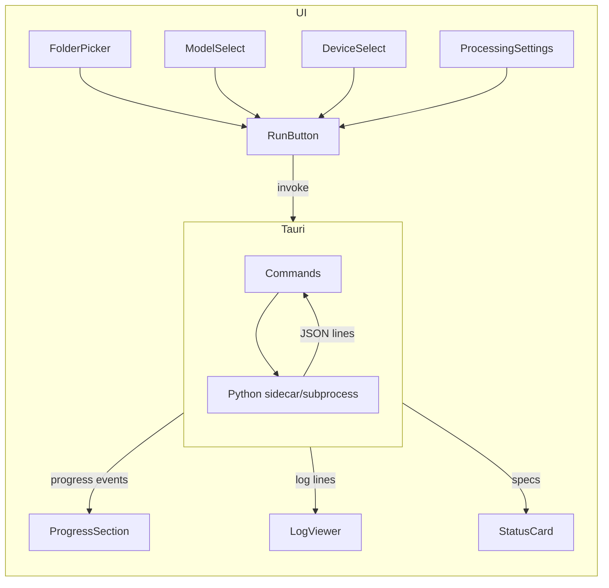

# Palm Counting AI – Rebuild dengan DDD + Tauri + shadcn

## 1. Target struktur folder

```
Palm counting AI/
├── python_ai/                    # Backend Python (DDD)
│   ├── domain/
│   ├── application/
│   ├── infrastructure/
│   ├── interfaces/
│   ├── model/                    # YOLO .pt (symlink atau copy dari pokok_kuning_gui/model)
│   └── requirements.txt
├── src/                          # Frontend Tauri (React + shadcn)
├── src-tauri/                    # Rust backend, invoke Python
└── ...
```

**Sumber migrasi:** [pokok_kuning_gui/core/processor.py](pokok_kuning_gui/core/processor.py), [config_manager](pokok_kuning_gui/utils/config_manager.py), [device_specs](pokok_kuning_gui/core/device_specs.py), [cli](pokok_kuning_gui/core/cli.py).

---

## 2. Arsitektur DDD – `python_ai`

### 2.1 Domain layer

- **Entities:** `DetectionResult` (counts, image path), `ProcessingConfig` (model, imgsz, conf, iou, device, export flags, dll).
- **Value objects:** `JgwParams`, `GeoFeature` (point + props).
- **Domain services:** tidak wajib di awal; logika inti di use case.

### 2.2 Application layer (use cases)

- **ProcessFolderUseCase:** input folder + `ProcessingConfig`, output ringkasan (success/fail, total abnormal/normal). Memanggil infrastructure (model, file, export).
- **LoadConfigUseCase / SaveConfigUseCase:** baca/tulis config (last used folder, model, imgsz, conf, iou, device, convert_kml/shp, save_annotated, dll).
- **GetSystemSpecsUseCase:** CPU, RAM, GPU (torch+CUDA), disk. Ringkasan untuk UI status.
- **ListModelsUseCase:** list `.pt` di `python_ai/model`.

Progress per file: emit via callback (dan nantinya via stdout JSON lines untuk Tauri).

### 2.3 Infrastructure layer

- **YoloDetector:** load YOLO, `detect_objects`, `save_annotated_frame`. Wrap [processor](pokok_kuning_gui/core/processor.py) logic (detection, validation, device selection).
- **GeoExporter:** `read_jgw`, `create_geojson`, `save_geojson`, `convert_geojson_to_kml`, `convert_geojson_to_shp`. Pakai geojson, shapely, fastkml, geopandas seperti saat ini.
- **ConfigRepository:** SQLite `configuration` table. Migrasi dari [config_manager](pokok_kuning_gui/utils/config_manager.py) (schema sama).
- **FileSystem:** resolve path model (dev vs frozen), list images, paths output.

### 2.4 Interfaces layer

- **CLI:** `python -m python_ai.interfaces.cli --folder ... --weights ...`. Mirip [cli](pokok_kuning_gui/core/cli.py), config dari CLI args. Stdout: log + JSON lines progress (satu JSON per baris) agar Tauri bisa parse.
- **Stdio JSON API (opsional):** alternative ke CLI; baca JSON-RPC-like commands dari stdin, tulis hasil + progress ke stdout. Bisa fase kedua.

---

## 3. Fungsi Python yang perlu ada (ringkas)

| Fungsi | Layer | Keterangan |

|--------|--------|------------|

| `ProcessFolderUseCase.execute(folder, config, progress_cb)` | Application | Orkestrasi process_folder |

| `LoadConfigUseCase.execute()` / `SaveConfigUseCase.execute(config)` | Application | Config load/save |

| `GetSystemSpecsUseCase.execute()` | Application | Specs untuk status UI |

| `ListModelsUseCase.execute()` | Application | List model .pt |

| `YoloDetector.detect(...)`, `save_annotated_frame(...)` | Infrastructure | YOLO + annotate |

| `GeoExporter.read_jgw`, `create_geojson`, `save_geojson`, `to_kml`, `to_shp` | Infrastructure | Geo export |

| `ConfigRepository.get()` / `save(config)` | Infrastructure | SQLite |

| CLI `main()` | Interfaces | Argparse + run use case, print JSON progress |

Config fields tetap sama: `model`, `imgsz`, `iou`, `conf`, `device`, `convert_kml`, `convert_shp`, `save_annotated`, `last_folder_path`, `max_det`, `line_width`, `show_labels`, `show_conf`, dll.

---

## 4. UI (Tauri + React + shadcn)

### 4.1 Stack

- **Frontend:** React (ganti Preact) + TypeScript + Vite.
- **Styling:** Tailwind v4 + shadcn/ui (init lewat `pnpm dlx shadcn@latest init`).
- **Tauri:** [src-tauri](Palm counting AI/src-tauri/) tetap; tambah commands untuk Python.

### 4.2 Halaman / layout

- **Single-window layout:** Sidebar (opsional) + main content.
- **Route:** Satu halaman utama (dashboard) cukup untuk MVP.

### 4.3 Komponen UI yang perlu dibuat

| Komponen | Deskripsi | shadcn dipakai |

|----------|-----------|----------------|

| **Header** | Judul app, logo, maybe theme toggle | - |

| **StatusCard** | DB connected, system ready, folder dipilih, total files, process status, model, GPU/RAM/CPU | Card, Badge |

| **FolderPicker** | Input path folder + tombol Browse (buka native dialog via Tauri) | Input, Button |

| **ModelSelect** | Dropdown list model dari `ListModels` + opsi custom path (browse) | Select, Button |

| **DeviceSelect** | Dropdown: auto | cpu | cuda | Select |

| **ProcessingSettings** | imgsz, conf, iou, max_det, line_width; checkboxes convert_kml, convert_shp, save_annotated, show_labels, show_conf | Input, Checkbox, Slider (optional), Label |

| **RunButton** | Start processing, disable saat running | Button |

| **ProgressSection** | Progress bar (processed/total), current file, ETA, abnormal/normal counts | Progress, Card |

| **LogViewer** | Scrollable log (append-only), clear, save to file | ScrollArea, Button |

| **SettingsSheet/Dialog** | Form settings (atau inline); simpan ke config | Sheet/Dialog, Form |

Alias `@/` ke `./src`, komponen shadcn di `src/components/ui/`.

### 4.4 Alur data UI



---

## 5. Integrasi Tauri – Python

### 5.1 Opsi

- **A) Sidecar:** Bundle Python embed atau pakai `python` di PATH. Tauri `Command` spawn sidecar, pass `--folder`, `--config-json`, dll. Python CLI emit progress JSON lines ke stdout; Rust baca dan forward ke frontend (e.g. event).
- **B) Shell spawn:** Tanpa bundle Python. `std::process::Command` run `python -m python_ai.interfaces.cli ...`. Same stdout contract.

Rekomendasi: **B** dulu (shell spawn). Sidecar bisa menyusul kalau mau distribusi tanpa dependency Python global.

### 5.2 Tauri commands

- **`select_folder()`** – dialog pilih folder, return path. Pakai `tauri-plugin-dialog` atau `tauri-plugin-shell` (open) sesuai kebutuhan; alternatif `@tauri-apps/plugin-dialog` if available.
- **`select_model_file()`** – dialog pilih file `.pt`, return path.
- **`list_models()`** – invoke Python `ListModelsUseCase` (script kecil atau CLI subcommand) atau implement di Rust dengan list dir `python_ai/model`.
- **`get_system_specs()`** – invoke Python `GetSystemSpecsUseCase`, return JSON. Bisa script terpisah atau `python -m python_ai.interfaces.cli --specs-only` (perlu ditambah).
- **`load_config()`** – invoke Python load config, return JSON.
- **`save_config(config_json)`** – invoke Python save config.
- **`run_processing(folder, config_json)`** – spawn `python -m python_ai.interfaces.cli ...`, stream stdout, parse JSON lines, emit progress + log ke frontend (e.g. `emit` ke window). Frontend dengar event dan update ProgressSection + LogViewer.

### 5.3 Contract stdout CLI

- Log human-readable: bebas.
- Progress: satu JSON object per line, e.g. `{"type":"progress","processed":1,"total":10,"current_file":"a.jpg",...}`.
- Final: `{"type":"done","successful":10,"failed":0,"total_abnormal":...,"total_normal":...}`.
- Error: `{"type":"error","message":"..."}`.

Rust baca line-by-line, parse JSON, emit ke frontend.

---

## 6. Langkah implementasi (urutan)

1. **Setup `python_ai` DDD**

   - Buat struktur `domain/`, `application/`, `infrastructure/`, `interfaces/`.
   - Pindah dan refactor logic dari `processor`, `config_manager`, `device_specs` ke layer yang sesuai.
   - Implement CLI dengan stdout JSON progress; tambah `--specs-only`, `--list-models` jika pakai Python untuk specs/models.

2. **Model & config**

   - Copy atau symlink `model/*.pt` ke `python_ai/model`, atau tetap pakai `pokok_kuning_gui/model` dengan path yang bisa dikonfigurasi.
   - Pastikan SQLite config path mengarah ke app data (mis. di bawah Tauri `app_data` atau project root) supaya konsisten.

3. **Frontend: React + Tailwind + shadcn**

   - Ganti Preact → React di [package.json](Palm counting AI/package.json) dan [vite.config](Palm counting AI/vite.config.ts).
   - Tambah Tailwind v4 + `@tailwindcss/vite`, konfigurasi `@/` di tsconfig dan Vite.
   - `pnpm dlx shadcn@latest init` di `Palm counting AI`, lalu add component: `button`, `card`, `input`, `label`, `select`, `checkbox`, `progress`, `scroll-area`, `sheet` (atau `dialog`), `badge`.

4. **Tauri commands**

   - Implement `select_folder`, `select_model_file`, `list_models`, `get_system_specs`, `load_config`, `save_config`, `run_processing`.
   - Untuk `run_processing`: spawn Python, stream stdout, parse JSON lines, emit events. Pasang `tauri-plugin-dialog` (atau等同) untuk file/folder picker jika belum.

5. **Build halaman utama**

   - Layout: Header + StatusCard + FolderPicker + ModelSelect + DeviceSelect + ProcessingSettings + RunButton + ProgressSection + LogViewer.
   - Load config dan specs on mount; simpan config on save; hook Run ke `run_processing`, event progress/log ke state → UI.

6. **Testing & bersih-bersih**

   - Test CLI standalone (`python -m python_ai.interfaces.cli --folder ...`).
   - Test Tauri dev: pilih folder, run, cek progress dan log.
   - Hapus atau skip kode lama yang sudah tergantikan (mis. greet, sample Preact); pastikan build production jalan.

---

## 7. File kunci yang diubah/dibuat

| File | Aksi |

|------|------|

| `Palm counting AI/python_ai/` | Buat struktur DDD + use cases + infra + CLI |

| `Palm counting AI/package.json` | React, Tailwind, shadcn deps; hapus Preact |

| `Palm counting AI/vite.config.ts` | React plugin, Tailwind, alias `@` |

| `Palm counting AI/tsconfig*.json` | `baseUrl` + `paths` untuk `@/` |

| `Palm counting AI/src-tauri/src/lib.rs` | Tauri commands + spawn Python + emit |

| `Palm counting AI/src-tauri/Cargo.toml` | deps plugin (dialog, dll) jika dipakai |

| `Palm counting AI/src/App.tsx` | Layout + komponen UI di atas |

| `Palm counting AI/src/components/ui/*` | shadcn components |

| `Palm counting AI/python_ai/requirements.txt` | Sama seperti [pokok_kuning_gui](pokok_kuning_gui/requirements.txt) (minus PyQt5) |

---

## 8. Clarifications (optional)

- **Preact vs React:** Plan pakai React agar shadcn didukung penuh. Jika tetap Preact, perlu uji kompatibilitas shadcn (alias `react` → `preact/compat`).
- **Database config:** Tetap SQLite single-file seperti sekarang; path bisa disesuaikan agar shared antara CLI standalone dan Tauri app.
- **`pokok_kuning_gui`:** Tetap ada; hanya dipindah logic ke `python_ai`. Bisa deprecate kemudian atau tetap dipakai sebagai alternatif PyQt5.