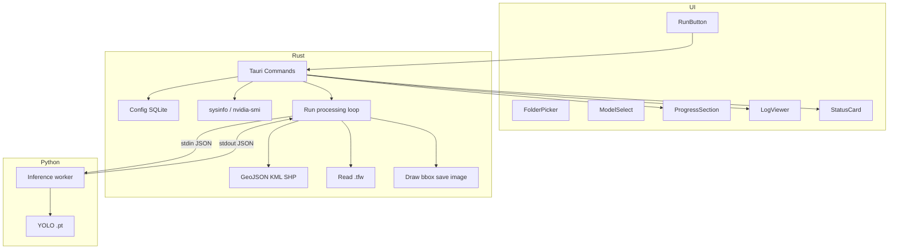

# Palm Counting AI – Rebuild Hybrid (Rust + Python Minimal)

## 1. Arsitektur hybrid

- **Python:** Hanya YOLO. Load `.pt` sekali, terima request per gambar lewat stdin (JSON), return detections (JSON) ke stdout. Subprocess **long-lived**.
- **Rust:** UI (Tauri), config, geo export, .tfw, annotated images, specs, CLI, orchestration. Rust spawn Python inference worker, kirim path gambar + config, terima detections, lakukan sisanya.



---

## 2. Target struktur folder

```
Palm counting AI/
├── python_ai/                    # Python minimal (inference only)
│   ├── infer_worker.py           # stdin/stdout JSON, load .pt, predict
│   ├── requirements.txt          # ultralytics, torch, Pillow; no PyQt5, no geopandas
│   └── model/                    # .pt (symlink atau copy dari pokok_kuning_gui/model)
├── src/                          # Frontend Tauri (React + shadcn)
├── src-tauri/
│   └── src/
│       ├── lib.rs                # Tauri commands
│       ├── config.rs             # SQLite config
│       ├── specs.rs              # sysinfo, nvidia-smi
│       ├── geo.rs                # .tfw, GeoJSON, KML, SHP
│       ├── annotate.rs           # draw bbox, save image
│       └── infer.rs              # spawn Python worker, send/recv JSON
└── ...
```

**Tidak ada** `python_ai` DDD (domain/application/infrastructure). Hanya satu script inference + `requirements.txt`.

---

## 3. Python inference worker

### 3.1 Tanggung jawab

- Baca JSON lines dari **stdin**. Setiap baris = satu request.
- Request: `{"image": "/path/to.jpg", "model": "/path/model.pt", "imgsz": 1280, "conf": 0.2, "iou": 0.2, "device": "cuda"}`.
- Load model `.pt` **sekali** saat pertama dapat `model` path (atau saat startup).
- Untuk tiap request: `predict` → ambil boxes (x1,y1,x2,y2, class_id, conf) → tulis **satu** JSON line ke **stdout**.
- Response: `{"detections": [{"x1", "y1", "x2", "y2", "class_id", "conf"}, ...], "error": null}`. Jika gagal: `{"detections": [], "error": "..."}`.

### 3.2 Flow

1. Rust spawn `python python_ai/infer_worker.py` (atau `python -m python_ai.infer_worker`).
2. Rust kirim N request (satu per gambar); worker baca stdin, infer, tulis stdout.
3. Rust baca stdout line-by-line, parse JSON, lanjut ke .tfw → geo → annotate.

### 3.3 Referensi

- Logika detect dari [processor.py](pokok_kuning_gui/core/processor.py) `detect_objects` (tanpa geo, tanpa config DB). Hanya YOLO load + predict + format output.

---

## 4. Rust – config, specs, geo, annotate

### 4.1 Config

- **Storage:** SQLite (atau JSON file di app data). Schema mengikuti [config_manager](pokok_kuning_gui/utils/config_manager.py): `model`, `imgsz`, `iou`, `conf`, `device`, `convert_kml`, `convert_shp`, `save_annotated`, `last_folder_path`, `max_det`, `line_width`, `show_labels`, `show_conf`, dll.
- **Crate:** `rusqlite`. Tauri commands `load_config`, `save_config` baca/tulis via Rust.

### 4.2 Specs

- **CPU / RAM:** `sysinfo`.
- **GPU:** Parse `nvidia-smi` atau pakai crate yang wrap. Tauri command `get_system_specs` return JSON untuk StatusCard.

### 4.3 Geo

- **.tfw:** Baca 6 float dari file. Pixel → map: `map_x = ulx + x * px_w`, `map_y = uly + y * py_h` (ikuti [processor](pokok_kuning_gui/core/processor.py) `image_to_map_coords`).
- **GeoJSON:** Crate `geojson`. Dari detections (center bbox) + .tfw → FeatureCollection → write file.
- **KML:** Crate atau tulis manual (format sederhana).
- **Shapefile:** Crate `geozero`, `shapefile`, atau equivalent. GeoJSON → Shapefile jika `convert_shp` true.

### 4.4 Annotated images

- **Rust:** Load image (`image` crate atau `opencv`), gambar rectangle + label dari detections, simpan ke `folder/annotated/`. Pakai `line_width`, `show_labels`, `show_conf` dari config.

### 4.5 List models

- **Rust:** List `.pt` di `python_ai/model` (atau path dari config). Tauri command `list_models` return list nama/custom path.

---

## 5. Tauri commands

| Command | Implementasi |

|--------|---------------|

| `select_folder` | Dialog pilih folder (`tauri-plugin-dialog` atau built-in). Return path. |

| `select_model_file` | Dialog pilih file `.pt`. Return path. |

| `list_models` | Rust list dir `model/*.pt` (+ custom path dari config). |

| `get_system_specs` | Rust `sysinfo` + GPU. Return JSON. |

| `load_config` | Rust SQLite/JSON. Return config object. |

| `save_config` | Rust simpan ke SQLite/JSON. |

| `run_processing` | Spawn Python worker, loop gambar: kirim JSON request → terima JSON response → .tfw → geo → annotate. Emit **progress** dan **log** ke frontend via Tauri events. |

**Tidak ada** invoke Python untuk config, specs, atau list_models. Hanya `run_processing` yang pakai Python.

---

## 6. Contract JSON (Rust ↔ Python)

**Rust → Python (per gambar):**

```json
{"image": "C:/data/a1.jpg", "model": "C:/app/model/yolov8n-pokok-kuning.pt", "imgsz": 1280, "conf": 0.2, "iou": 0.2, "device": "cuda"}
```

**Python → Rust:**

```json
{"detections": [{"x1": 100, "y1": 200, "x2": 150, "y2": 250, "class_id": 0, "conf": 0.92}], "error": null}
```

Rust hitung center dari bbox, pakai .tfw → koordinat peta, buat GeoJSON/KML/SHP dan optional annotated image.

---

## 7. UI (Tauri + React + shadcn)

### 7.1 Stack

- **Frontend:** React + TypeScript + Vite. Ganti Preact → React.
- **Styling:** Tailwind v4 + shadcn/ui (`pnpm dlx shadcn@latest init`).
- **Tauri:** [src-tauri](Palm counting AI/src-tauri/); commands di atas.

### 7.2 Komponen (unchanged)

- **Header**, **StatusCard** (specs dari `get_system_specs`), **FolderPicker**, **ModelSelect**, **DeviceSelect**, **ProcessingSettings**, **RunButton**, **ProgressSection**, **LogViewer**, **SettingsSheet/Dialog**.
- Alias `@/` → `./src`, shadcn di `src/components/ui/`.

### 7.3 Alur

- **Run:** Frontend invoke `run_processing(folder, config_json)`. Tauri spawn Python worker, orchestrate di Rust, emit progress + log. UI update ProgressSection dan LogViewer.
- **Config / specs / list_models:** Semua dari Rust; tidak ada Python.

---

## 8. Langkah implementasi (urutan)

1. **Python inference worker**

   - Buat `python_ai/infer_worker.py` + `requirements.txt` (ultralytics, torch, Pillow).
   - Loop stdin → JSON request → predict → stdout JSON. Load model sekali.

2. **Rust – geo + annotate**

   - Modul `tfw`, `geo` (GeoJSON, KML, SHP), `annotate` (draw bbox, save). Unit test pakai sample image + .tfw.

3. **Rust – config + specs + list_models**

   - `config.rs` (SQLite), `specs.rs` (sysinfo, GPU), `list_models` (list dir). Expose via Tauri commands.

4. **Tauri – run_processing**

   - Spawn worker, kirim request per gambar, terima response, panggil geo + annotate, emit progress/log. Integrasi dengan `infer.rs`.

5. **Frontend – React + Tailwind + shadcn**

   - Init shadcn, komponen UI, layout. Hook `run_processing`, `load_config`, `save_config`, `get_system_specs`, `list_models`, folder/model pickers.

6. **Integration & deploy**

   - Test run processing end-to-end. Build Tauri app. Pastikan Python + deps tersedia di mesin user (atau bundle jika pakai sidecar).

---

## 9. File kunci

| File | Aksi |

|------|------|

| `Palm counting AI/python_ai/infer_worker.py` | Baru. Stdin/stdout JSON, YOLO infer only. |

| `Palm counting AI/python_ai/requirements.txt` | ultralytics, torch, Pillow (minimal). |

| `Palm counting AI/python_ai/model/` | Symlink atau copy `.pt` dari pokok_kuning_gui. |

| `Palm counting AI/src-tauri/src/lib.rs` | Tauri commands, register handler. |

| `Palm counting AI/src-tauri/src/infer.rs` | Spawn worker, send/recv JSON. |

| `Palm counting AI/src-tauri/src/config.rs` | SQLite config. |

| `Palm counting AI/src-tauri/src/specs.rs` | sysinfo, nvidia-smi. |

| `Palm counting AI/src-tauri/src/geo.rs` | .tfw, GeoJSON, KML, SHP. |

| `Palm counting AI/src-tauri/src/annotate.rs` | Draw bbox, save image. |

| `Palm counting AI/package.json` | React, Tailwind, shadcn; hapus Preact. |

| `Palm counting AI/vite.config.ts` | React, Tailwind, alias `@`. |

| `Palm counting AI/src/App.tsx` | Layout + komponen utama. |

---

## 10. Ringkasan

- **Python:** Hanya inference worker. Input/output JSON via stdin/stdout. Model .pt tetap.
- **Rust:** Config, specs, list models, geo export, annotated images, orchestration, Tauri commands. Tidak ada DDD di Python.
- **Con:** User tetap butuh Python + PyTorch/ultralytics. **Pro:** Tidak ubah model ke ONNX; Python minimal dan terisolasi.